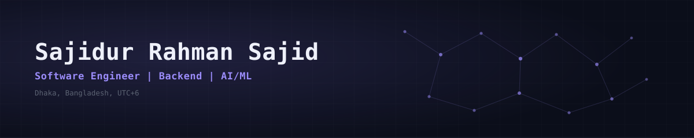

<div align="center">

<picture>
  <source media="(prefers-color-scheme: dark)" srcset="assets/banner-dark.svg">
  <source media="(prefers-color-scheme: light)" srcset="assets/banner-light.svg">
  
</picture>


<br/>

<a href="mailto:sajidsajidurrahman99@gmail.com"></a>

<br/><br/>

<a href="https://sajidur.me"></a>
<a href="https://github.com/Saji-d"></a>
<a href="https://www.linkedin.com/in/sajidur-rahman-sajid/"></a>
<a href="mailto:sajidsajidurrahman99@gmail.com"></a>

<br/><br/>


</div>

```
$ whoami
```

```python
role      = "Software Developer Trainee @ Ledgercross"
focus     = ["Full-Stack Engineering", "Applied AI/ML", "Backend Systems"]
education = "BSc CSE, AIUB (3.92 / 4.00)"
```

I build full-stack software and production-oriented AI/ML systems, from data pipelines and model training to APIs, databases, and the interfaces people use. Most of that work sits where backend engineering meets applied AI.

## Focus

<table width="100%">
<tr>
<td width="33%" align="center">

**AI / ML**
`OCR` `NLP` `RAG` `Computer Vision`

</td>
<td width="33%" align="center">

**Backend**
`APIs` `Pipelines` `Databases` `Auth`

</td>
<td width="33%" align="center">

**Full-Stack**
`React` `Next.js` `TypeScript` `Systems`

</td>
</tr>
</table>

## Currently

```
InvoicePilot   ->  AI invoice processing platform: OCR, validation, anomaly detection
CaseVault      ->  Privacy-first legal research workspace, GraphRAG over case law
Fumak          ->  Inventory + POS system running in a live retail business
Ledgercross    ->  Software Developer Trainee: APIs, async processing, data layers
```

## Selected Projects

**InvoicePilot** · `production`
AI-powered invoice processing platform. An 11-stage pipeline extracts, validates, and normalizes invoice data via OCR, then flags duplicates and anomalies before it reaches the API.
`React` `Fastify` `FastAPI` `PostgreSQL` `BullMQ`

**CaseVault** · `production`
Privacy-first legal research workspace for Bangladeshi case law. Ingests case documents and ranks results with GraphRAG over a knowledge graph, backed by dedicated vector and graph stores.
`GraphRAG` `Neo4j` `Qdrant` `FastAPI` `LLMs`

**[Fumak Inventory Management](https://github.com/Saji-d/fumak-inventory)** · `production`
Inventory and point-of-sale system running in an active retail business, with barcode scanning across a native Android app and a web admin console.
`Kotlin` `Jetpack Compose` `Next.js` `Neon PostgreSQL` `Prisma`

**[LedgerTurf](https://github.com/Saji-d/ledgerturf)** · [`live`](https://ledgerturf.vercel.app)
Real-time turf booking platform. Players discover and reserve grounds on a map, backed by geospatial queries over MongoDB's 2dsphere indexes.
`Next.js` `TypeScript` `Mapbox` `MongoDB`

**[FinBERT Financial Sentiment](https://github.com/Saji-d/financial-sentiment-analysis-bert)** · `NLP`
Comparative study showing a domain-tuned transformer outperforms generic sentiment models on financial text.
`BERT` `Transformers` `PyTorch`

**[Face Recognition System](https://github.com/Saji-d/face-recognition-system)** · `computer vision`
Real-time face identification pipeline: detects faces in video, trains embeddings, and matches identities against a known set.
`Python` `OpenCV` `FaceNet`

## Research

**[Neuro-Screen](https://github.com/Saji-d/neuro-screen)** · hybrid CatBoost + ANN ensemble for cognitive-impairment risk screening in insomniac university students. 2,237 survey responses, 95.2% accuracy, 0.982 ROC-AUC.

**Explainable Bangla Toxic Comment Detection** · BanglaBERT fine-tuned for toxicity detection in Bengali text, IEEE-format paper. 86% accuracy, 0.91 ROC-AUC, 5-fold cross-validation.

**Early Warning Model for High-Value Customer Drop-Off** · RFM feature engineering, K-Means segmentation, and Random Forest on the UCI Online Retail dataset. 0.79 ROC-AUC across a 4,338-customer base.

## Tech Stack

<div align="center">

**Languages**


**AI / ML**


**Systems, Data & Web3**


**Also**


</div>

## GitHub Analytics

<div align="center">

</div>

<table width="100%">
<tr>
<td width="50%">

</td>
<td width="50%">

</td>
</tr>
<tr>
<td width="50%">

</td>
<td width="50%">

</td>
</tr>
</table>

<div align="center">


<br/>


</div>

## Experience

**Ledgercross** · Software Developer Trainee · May 2026 – Present
Production software across the stack for enterprise finance: REST APIs, async processing, multi-tenant data layers, automated testing, and cloud infrastructure.

**Bangladesh Software Solution** · Software Engineering Intern · Feb 2026 – Apr 2026
Built and shipped responsive web applications, integrating frontend features with RESTful APIs.

## Education

**BSc, Computer Science & Engineering** · American International University-Bangladesh · 2022 – 2026
`CGPA 3.92 / 4.00` `5x Dean's Award` `Merit Scholarship, up to 70%`

---

<div align="center">

```
$ availability
```

Open to full-stack, platform, and applied ML roles, plus select freelance and product work.

[`Portfolio`](https://sajidur.me) · [`GitHub`](https://github.com/Saji-d) · [`LinkedIn`](https://www.linkedin.com/in/sajidur-rahman-sajid/) · [`Email`](mailto:sajidsajidurrahman99@gmail.com)

</div>
